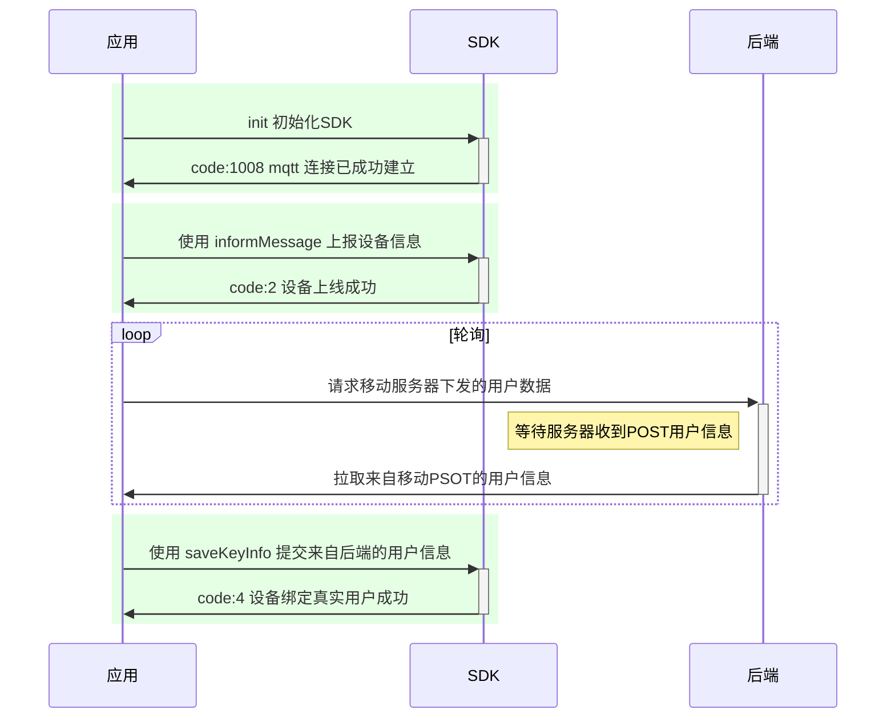

# 移动合家亲 SDK 接入流程

> update 2022-03-07 21:06:37

# 绑定流程

基于 移动 Andlink SDK 1.5.1

```mermaid

sequenceDiagram
    rect rgba(0, 255, 0, .1)
    应用->>+SDK:    init 初始化SDK
    SDK ->>-应用:   code:1008 mqtt 连接已成功建立
    end
    rect rgba(0, 255, 0, .1)
    应用->>+SDK:    使用 informMessage 上报设备信息
    SDK ->>-应用:   code:2 设备上线成功
    end
    loop 轮询
        应用->>+后端:   请求移动服务器下发的用户数据
        note right of SDK: 等待服务器收到POST用户信息
        后端->>-应用:   拉取来自移动PSOT的用户信息
    end
    rect rgba(0, 255, 0, .1)
    应用->>+SDK:    使用 saveKeyInfo 提交来自后端的用户信息
    SDK ->>-应用:   code:4 设备绑定真实用户成功
    end

```

# 参考文献

-   [And-linkSDK(Android)接入说明](https://docs.qq.com/doc/DVExweEdWSmhNUmFt)
